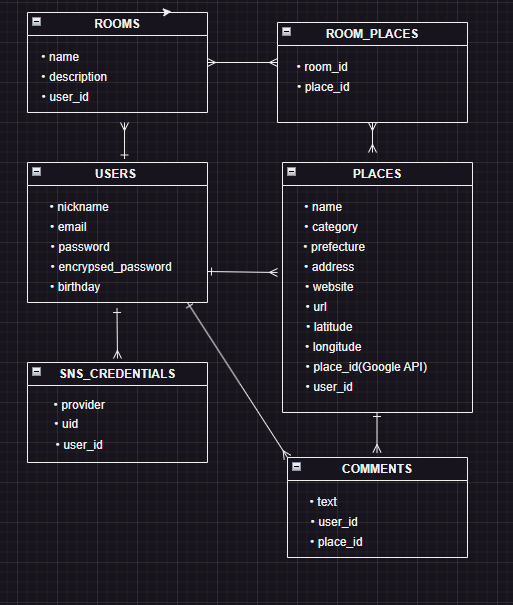
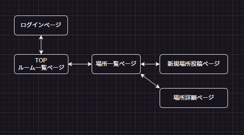

## アプリケーション名
「その界隈」

## アプリケーション概要
特定のニーズを持つユーザー同士が、そのニーズを満たす場所情報を「その界隈」の人たちの中で共有できるニッチな需要を満たすアプリです。

## アプリケーションを作成した背景
Googleのマイマップ機能が好きで、インスタやXなどで情報を集めながら地図に落とし込んでいました。しかしながら、以下の3点に不便を感じていました。

- インスタやXではタイムラインで流れてしまい、情報の一元化には不向き。
- Google Mapでの口コミは不特定多数の人によるもので、必要な情報だけを効率的に収集できない。
- Googleのマイマップは、情報の共有が一方通行。

同じ目的をもつ人が効率的かつ効果的に情報を共有し、かつ自分の情報収集に役立てるため、このアプリの作成に至りました。

## URL

## テスト用アカウント
メール：test@test.com
パスワード：test2025
## 利用方法
1. トップページから新規登録/ログインする。（SNSでのログインも可能）
2. 場所の一覧が表示される
3. 場所一覧の右下の「＋」ボタンで場所を追加する
4. 場所一覧の場所の名前をクリックすると詳細画面に遷移しコメントできる
## 洗い出した要件
- サインイン／ログインページ
- トップページ（Room一覧ページ）
- 場所一覧ページ
- 場所を追加するページ
- 場所詳細ページ（コメント機能）
## 実装した機能についての画像やGIF及びその説明
## 実装予定の機能
- Roomの公開/非公開機能
- テキストエリアでの改行入力、改行表示
- 場所のタグ付け機能
- ユーザーのアイコン表示（SNS認証の場合はSNSの画像を使用）
## データベース設計

## 画面遷移図

## 開発環境
- フロントエンド: HTML, CSS, JavaScript
- バックエンド: Ruby on Rails7
- API: Maps JavaScript API, Places API, SNS認証の為のAPI(Google, X)
## 工夫したポイント
- 場所を登録する際にユーザーは数クリックするだけで、場所名、都道府県、カテゴリー、ウェブサイトのURL、Google mapのURLを自動取得できるように工夫した。
- 表示されないが、裏で緯度経度、Googleに登録されたplace_idも取得しており、重複した場所を登録できないようにした。
- 投稿された場所やコメント日時が表示されるが、3日未満は投稿からcreated_atを引いて、秒、分、時間、日で表示されるようにした。

